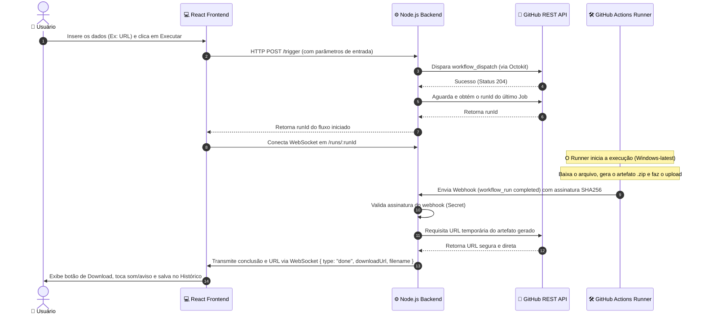

# 📥 Downloader — GitHub Actions Flow Control & Monitor

<p align="center">
  
  
  
  
</p>

Este é um ecossistema **full-stack** de download remoto projetado para utilizar a robusta infraestrutura de rede e processamento do **GitHub Actions** para baixar arquivos, compilar pacotes e buscar instaladores, tudo controlado por uma interface moderna em tempo real.

O projeto consiste de uma interface visual interativa (React), um servidor intermediador (Node.js/Express) e diversos workflows configurados para rodar em instâncias efêmeras do Windows no GitHub Runners, integrados via **WebSockets** e **Webhooks** para um feedback instantâneo.

---

## 🗺️ Arquitetura e Fluxo do Ecossistema

O sistema é totalmente orientado a eventos e funciona de maneira assíncrona. O diagrama abaixo detalha a comunicação em tempo real de ponta a ponta:



---

## ✨ Funcionalidades Principais

*   🚀 **Download via URL Direta**: Baixe qualquer arquivo da internet direto pela infraestrutura do GitHub Actions (extensões como `.exe`, `.msi`, `.zip`, `.rar`, etc.). O link final é servido de forma compactada.
*   🐍 **Download offline de Dependências Python**: Especifique uma ou múltiplas bibliotecas Python (ex: `pandas selenium numpy`). O GitHub runner compila/baixa as wheels compatíveis com `win_amd64` e disponibiliza tudo em um único `.zip`.
*   📦 **WinGet**: Suporte para download e pesquisa de aplicativos no catálogo oficial do Windows Package Manager (WinGet), gerando instaladores limpos de forma autônoma.
*   ⚡ **Monitoramento em Tempo Real (WebSockets)**: A interface avisa em tempo real se o download está disparando, aguardando execução, buscando artefato, finalizado ou se ocorreu algum erro.
*   ⏳ **Histórico de Downloads**: Histórico de downloads persistido localmente no navegador (`localStorage`).
*   🎨 **Interface Premium e Moderna**: UI responsiva construída em React, contendo tratamentos robustos de erros (`ErrorBoundary`), validações de campos e feedback tátil por meio de animações.

---

## 🛠️ Tecnologias Utilizadas

### Frontend
*   **React 19** & **Vite 8** — Core do desenvolvimento e compilação ultra rápida.
*   **Vite Plugin SVGR** — Renderização de ícones SVG como componentes React.
*   **Vanilla CSS3** — Estilização personalizada, com efeitos modernos de Glassmorphism, feedback ativo nos botões e layout responsivo.

### Backend
*   **Express 5** — Servidor web rápido para gerenciar endpoints REST e rate limits.
*   **WebSockets (`ws`)** — Comunicação bidirecional contínua com o cliente.
*   **Octokit (`@octokit/rest`)** — Integração oficial e segura com a API REST do GitHub.
*   **Helmet & Express Rate Limit** — Camadas adicionais de segurança para proteger a API de sobrecargas e ataques.

### Infraestrutura & CI/CD
*   **GitHub Actions** — Automação dos downloads em runners virtuais Windows e deploy contínuo do frontend.
*   **GitHub Pages** — Hospedagem serverless do frontend compilado.

---

## 📂 Estrutura de Diretórios

```text
workflow/
├── backend/                  # Servidor Node.js
│   ├── config/               # Configurações de variáveis de ambiente
│   ├── middleware/           # CORS, Webhook Signature Check & Rate Limiters
│   ├── routes/               # Endpoints (/trigger, /webhook, /artifact)
│   ├── websocket/            # Gerenciador de conexões WebSocket em tempo real
│   ├── index.js              # Ponto de entrada do backend
│   └── package.json          # Dependências do servidor
│
└── frontend/                 # Aplicação Cliente React
    ├── .github/workflows/    # Workflows do GitHub (Downloads e Deploy)
    │   ├── deploy.yml        # Deploy automático do Frontend para o GitHub Pages
    │   ├── pip-download.yml  # Workflow de download de dependências Python
    │   ├── url-download.yml  # Workflow de download por URL genérica
    │   ├── winget-download.yml
    │   └── winget-search.yml
    ├── src/
    │   ├── assets/           # Arquivos estáticos e mídias
    │   ├── components/       # Componentes modulares (Formulários, Histórico, Ações)
    │   ├── hooks/            # Custom Hook (useWorkflow) para estado do WebSocket e API
    │   ├── index.css         # Design system e tokens CSS Globais
    │   └── main.jsx          # Ponto de entrada da aplicação
    ├── index.html            # Estrutura HTML base
    ├── vite.config.js        # Configuração do Vite
    └── package.json          # Dependências do cliente
```

---

## ⚙️ Configuração do Ambiente

Para que as duas partes do ecossistema se comuniquem perfeitamente, você precisará configurar as variáveis de ambiente.

### 1. Configurando o Backend (`backend/.env`)
Crie um arquivo `.env` na pasta `backend/` seguindo o modelo:

```env
PORT=3000
FRONTEND_URL=http://localhost:5173
OWNER=seu_usuario_github
REPO=nome_deste_repositorio
TOKEN=seu_github_personal_access_token
SECRET=sua_chave_secreta_webhook
WORKFLOW_URLDOWNLOAD=url-download.yml
WORKFLOW_PYDOWNLOAD=pip-download.yml
```

> [!TIP]
> * **TOKEN**: Requer um Personal Access Token (PAT) do GitHub com a permissão `workflows` (Classic) ou leitura/escrita em `Actions` e `Workflows` (Fine-grained).
> * **SECRET**: É um texto aleatório criado por você para assinar as requisições de Webhooks do GitHub e impedir requests falsos na sua API.

### 2. Configurando o Frontend (`frontend/.env`)
Crie um arquivo `.env` na pasta `frontend/`:

```env
VITE_API_URL=http://localhost:3000
VITE_WORKFLOW_URL=urldownload
VITE_WORKFLOW_PYTHON=pydownload
```

---

## 💻 Como Executar Localmente

### Passo 1: Inicializar o Backend
1. Navegue até a pasta do backend:
   ```bash
   cd backend
   ```
2. Instale as dependências:
   ```bash
   npm install
   ```
3. Inicialize o servidor de desenvolvimento:
   ```bash
   npm start
   ```
O servidor estará rodando em `http://localhost:3000` (e o servidor WebSocket correspondente estará escutando no mesmo endereço).

### Passo 2: Inicializar o Frontend
1. Em um novo terminal, navegue até a pasta do frontend:
   ```bash
   cd frontend
   ```
2. Instale as dependências:
   ```bash
   npm install
   ```
3. Inicie o servidor de desenvolvimento do Vite:
   ```bash
   npm run dev
   ```
Acesse o endereço exibido no terminal (geralmente `http://localhost:5173`) para usar a aplicação.

---

## 🔗 Configurando o GitHub Webhook

Para que o backend saiba exatamente quando o GitHub Actions terminou de gerar o seu arquivo e possa enviar a URL de download para o seu navegador, você precisa configurar um Webhook no seu repositório do GitHub:

1. Vá nas configurações do seu repositório no GitHub (**Settings**).
2. No menu lateral esquerdo, clique em **Webhooks** e em seguida no botão **Add webhook**.
3. Preencha os dados:
   * **Payload URL**: `https://seu-dominio-backend.com/webhook` (ou a URL pública do seu backend exposta via ngrok/localtunnel se estiver testando localmente).
   * **Content type**: Escolha `application/json`.
   * **Secret**: Insira o mesmo texto que você definiu na variável `SECRET` do seu `.env` do backend.
   * **Which events would you like to trigger this webhook?**: Escolha **Let me select individual events** e marque apenas **Workflow runs**.
4. Clique em **Add webhook**.

---

## 🚀 Implantação e Deploy em Produção

### Frontend (GitHub Pages)
O projeto já conta com o workflow do GitHub Actions em `.github/workflows/deploy.yml` configurado para automatizar o deploy.
Para que ele funcione:
1. Vá em **Settings** > **Secrets and variables** > **Actions** no seu repositório GitHub.
2. Adicione as seguintes **Repository Secrets**:
   * `VITE_API_URL`: A URL de produção da sua API (ex: `https://api-downloader.herokuapp.com`).
   * `VITE_WORKFLOW_URL`: `urldownload`
   * `VITE_WORKFLOW_PYTHON`: `pydownload`
3. Certifique-se de que as permissões de escrita do workflow em **Settings** > **Actions** > **General** > **Workflow permissions** estejam configuradas para **Read and write permissions**.
4. Faça um push para a branch `main`. O GitHub Actions irá compilar o build e enviar automaticamente para a branch `gh-pages`.

### Backend
Você pode implantar o backend em plataformas como **Render**, **Railway**, **Koyeb** ou em uma VPS de sua preferência:
* Basta hospedar a aplicação Node.js.
* Lembre-se de preencher as variáveis do `.env` correspondentes no painel administrativo do serviço de hospedagem escolhido.
* Certifique-se de expor a porta e liberar conexões WebSocket para o domínio do seu frontend no GitHub Pages.

---

## 📄 Notas de Segurança & Limites

> [!WARNING]
> * Este ecossistema é projetado para **uso pessoal**.
> * O backend contém um middleware de **Rate Limiting** para evitar chamadas excessivas na API de disparos e downloads.
> * Os arquivos baixados pelo runner virtual são temporariamente guardados nos artefatos da execução do GitHub e expiram automaticamente conforme configurado nos arquivos `.yml` (normalmente entre 1 e 2 dias), garantindo que nenhum dado sensível fique armazenado permanentemente no repositório.
