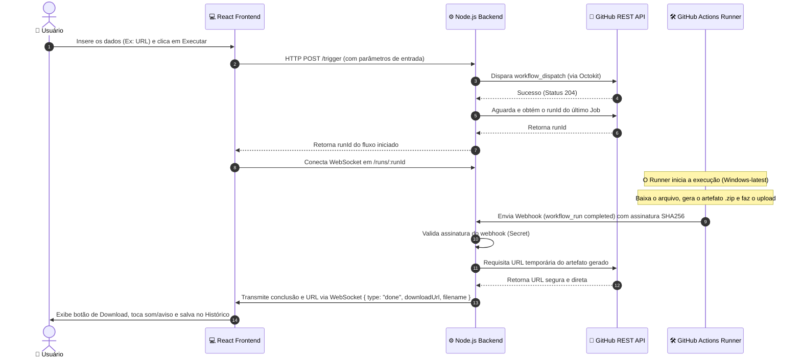

# 📥 Downloader — GitHub Actions Flow Control & Monitor

<p align="center">
  
  
  
</p>

Este projeto é a interface visual (**frontend**) e a suíte de workflows de automação de um ecossistema full-stack de download remoto. Ele permite que o usuário gerencie, dispare e monitore downloads executados diretamente na infraestrutura do **GitHub Actions** em tempo real.

---

### 🌐 Acesse a Aplicação em Produção:
👉 **[neotwr.github.io/downloader](https://neotwr.github.io/downloader)**

---

## 🗺️ Arquitetura e Fluxo do Ecossistema

A interface é altamente interativa, orientada a eventos e se conecta de maneira assíncrona ao backend e ao GitHub Actions para obter feedback instantâneo:



---

## ✨ Funcionalidades Principais

*   🚀 **Download via URL Direta**: Baixe qualquer arquivo da internet direto pela infraestrutura do GitHub Actions (extensões como `.exe`, `.msi`, `.zip`, `.rar`, etc.). O link final é servido de forma compactada.
*   🐍 **Download offline de Dependências Python**: Especifique uma ou múltiplas bibliotecas Python (ex: `pandas selenium numpy`). O GitHub runner compila/baixa as wheels compatíveis com `win_amd64` e disponibiliza tudo em um único `.zip`.
*   📦 **WinGet**: Suporte para download e pesquisa de aplicativos no catálogo oficial do Windows Package Manager (WinGet), gerando instaladores limpos de forma autônoma.
*   ⚡ **Monitoramento em Tempo Real (WebSockets)**: A interface avisa em tempo real se o download está disparando, aguardando execução, buscando artefato, finalizado ou se ocorreu algum erro.
*   ⏳ **Histórico de Downloads**: Histórico de downloads persistido localmente no navegador (`localStorage`).
*   🎨 **Interface Premium e Moderna**: UI responsiva construída em React, contendo tratamentos robustos de erros (`ErrorBoundary`), validações de campos e feedback tátil por meio de animações.

---

## 🛠️ Tecnologias Utilizadas

### Frontend
*   **React 19** & **Vite 8** — Core do desenvolvimento e compilação ultra rápida.
*   **Vite Plugin SVGR** — Renderização de ícones SVG como componentes React.
*   **Vanilla CSS3** — Estilização personalizada, com efeitos modernos de Glassmorphism, feedback ativo nos botões e layout responsivo.

### Infraestrutura & CI/CD
*   **GitHub Actions** — Automação dos downloads em runners virtuais Windows e deploy contínuo do frontend.
*   **GitHub Pages** — Hospedagem serverless do frontend compilado.

---

## 📂 Estrutura de Diretórios

```text
frontend/
├── .github/workflows/    # Workflows do GitHub (Downloads e Deploy)
│   ├── deploy.yml        # Deploy automático do Frontend para o GitHub Pages
│   ├── pip-download.yml  # Workflow de download de dependências Python
│   ├── url-download.yml  # Workflow de download por URL genérica
│   ├── winget-download.yml
│   └── winget-search.yml
├── public/               # Recursos estáticos públicos
├── src/
│   ├── assets/           # Arquivos estáticos e mídias
│   ├── components/       # Componentes modulares (Formulários, Histórico, Ações)
│   ├── hooks/            # Custom Hook (useWorkflow) para estado do WebSocket e API
│   ├── index.css         # Design system e tokens CSS Globais
│   └── main.jsx          # Ponto de entrada do React
├── index.html            # Estrutura HTML base
├── vite.config.js        # Configuração do Vite
└── package.json          # Dependências do cliente
```

---

## ⚙️ Configuração do Ambiente

Crie um arquivo `.env` na raiz da pasta `frontend/` com base nas variáveis abaixo:

```env
VITE_API_URL=http://localhost:3000
VITE_WORKFLOW_URL=urldownload
VITE_WORKFLOW_PYTHON=pydownload
```

---

## 💻 Como Executar Localmente

### Pré-requisitos
Certifique-se de ter o [Node.js](https://nodejs.org/) instalado. Para o correto funcionamento em tempo real, o backend correspondente deve estar ativo.

### Passo a Passo
1. Instale as dependências:
   ```bash
   npm install
   ```
2. Inicie o servidor de desenvolvimento do Vite:
   ```bash
   npm run dev
   ```
3. Acesse o endereço local exibido no terminal (geralmente `http://localhost:5173`) para interagir com a aplicação.

---

## 🚀 Implantação e Deploy (GitHub Pages)

O projeto já conta com o workflow do GitHub Actions em `.github/workflows/deploy.yml` configurado para automatizar o deploy.

Para configurá-lo:
1. Vá nas configurações do seu repositório GitHub em **Settings** > **Secrets and variables** > **Actions**.
2. Adicione as seguintes **Repository Secrets**:
   * `VITE_API_URL`: A URL de produção da sua API (ex: `https://sua-api.onrender.com`).
   * `VITE_WORKFLOW_URL`: `urldownload`
   * `VITE_WORKFLOW_PYTHON`: `pydownload`
3. Vá em **Settings** > **Actions** > **General** > **Workflow permissions** e certifique-se de que a permissão de escrita está ativa (**Read and write permissions**).
4. Faça um push para a branch `main`. O GitHub Actions irá compilar o build e enviar automaticamente para a branch `gh-pages`.

---

## 📄 Notas & Limites
* Os arquivos baixados pelo runner virtual são temporariamente guardados nos artefatos da execução do GitHub Actions e expiram automaticamente conforme configurado nos arquivos `.yml` (normalmente entre 1 e 2 dias), garantindo que nenhum dado fique armazenado permanentemente.
